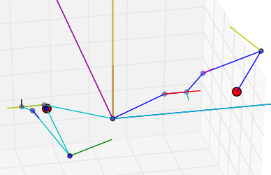
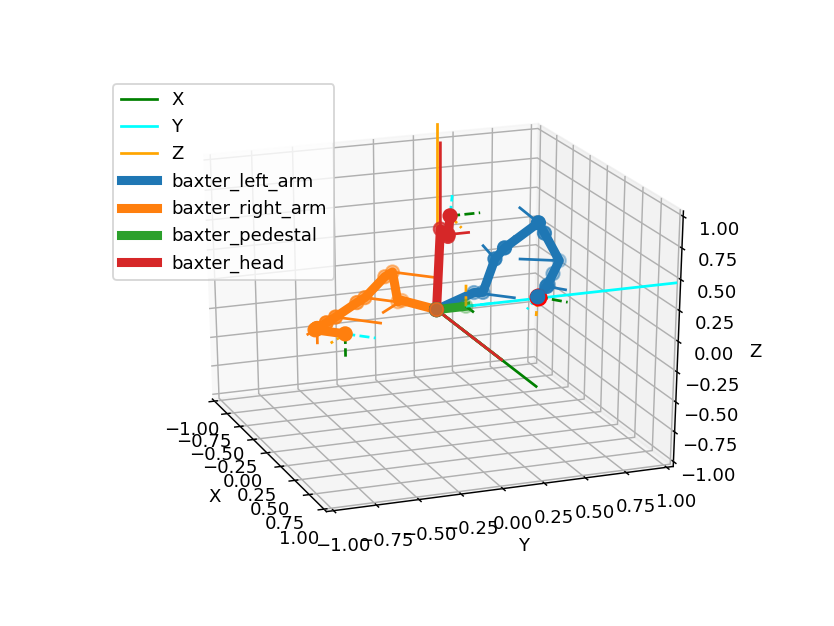
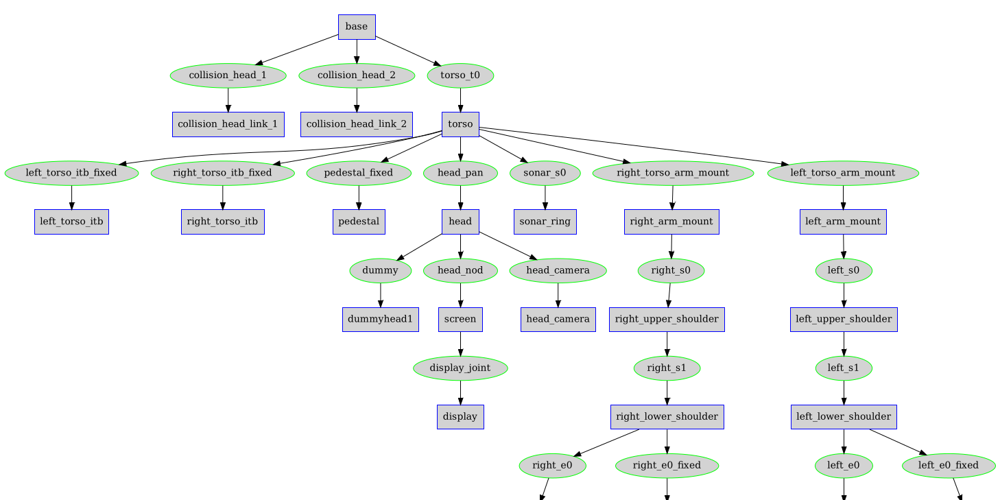

# IKPy

[](https://pypi.python.org/pypi/ikpy/)

[](https://doi.org/10.5281/zenodo.6551106)





## Demo

Live demos of what IKPy can do \(click on the image below to see the video\):


[](https://www.youtube.com/watch?v=H0ysr5qSbis)
[](https://www.youtube.com/watch?v=Jq0-DkEwwj4)

Also, a presentation of IKPy: [Presentation](https://github.com/Phylliade/ikpy/blob/master/tutorials/IKPy%20speech.pdf).

## Features

With IKPy, you can:

* Compute the **Inverse Kinematics** of every existing robot.
* Compute the Inverse Kinematics in **position, [orientation](./tutorials/Orientation.ipynb)**, or both
* Define your kinematic chain using **arbitrary representations**: DH (Denavit–Hartenberg), URDF, custom...
* Automatically import a kinematic chain from a **URDF file**.
* Support for arbitrary joint types: `revolute`, `prismatic` and more to come in the future 
* Use pre-configured robots, such as [**baxter**](./tutorials/Baxter%20kinematics.ipynb) or the **poppy-torso**
* IKPy is **precise** (up to 7 digits): the only limitation being your underlying model's precision, and **fast**: from 7 ms to 50 ms (depending on your precision) for a complete IK computation.
* **Plot** your kinematic chain: no need to use a real robot (or a simulator) to test your algorithms!
* Define your own Inverse Kinematics methods.
* Utils to parse and analyze URDF files:



Moreover, IKPy is a **pure-Python library**: the install is a matter of seconds, and no compiling is required.

## Installation

You have three options:

1. From PyPI \(recommended\) - simply run:

   ```bash
   pip install ikpy
   ```

   If you intend to plot your robot, you can install the plotting dependencies \(mainly `matplotlib`\):

   ```bash
   pip install 'ikpy[plot]'
   ```

2. From source - first download and extract the archive, then run:

   ```bash
   pip install ./
   ```

   NB: You must have the proper rights to execute this command

## Quickstart

Follow this IPython [notebook](https://github.com/Phylliade/ikpy/blob/master/tutorials/Quickstart.ipynb).

## Guides and Tutorials

Go to the [wiki](https://github.com/Phylliade/ikpy/wiki). It should introduce you to the basic concepts of IKPy.

## API Documentation

An extensive documentation of the API can be found [here](http://ikpy.readthedocs.org).

## Dependencies and compatibility

Starting with IKPy v3.1, only Python 3 is supported. 
For versions before v3.1, the library can work with both versions of Python \(2.7 and 3.x\).

In terms of dependencies, it requires `numpy` and `scipy`.


`sympy` is highly recommended, for fast hybrid computations, that's why it is installed by default.

`matplotlib` is optional: it is used to plot your models \(in 3D\).

## Contributing

IKPy is designed to be easily customisable: you can add your own IK methods or robot representations \(such as DH-Parameters\) using a dedicated [developer API](https://github.com/Phylliade/ikpy/wiki/Contributing).

Contributions are welcome: if you have an awesome patented \(but also open-source!\) IK method, don't hesitate to propose adding it to the library!

## Links

* If performance is your main concern, `aversive++` has an inverse kinematics [module](https://github.com/AversivePlusPlus/ik) written in C++, which works the same way IKPy does.

## Citation

If you use IKPy as part of a publication, please use the Bibtex below as a citation:

```bibtex
@software{manceron_pierre_2022_6551158,
  author       = {Manceron, Pierre},
  title        = {IKPy},
  month        = may,
  year         = 2022,
  note         = {{If you use this software, please cite it using the 
                   metadata from this file.}},
  publisher    = {Zenodo},
  version      = {v3.3.3},
  doi          = {10.5281/zenodo.6551158},
  url          = {https://doi.org/10.5281/zenodo.6551158}
}
```
