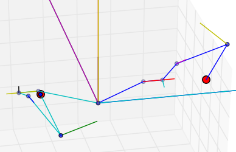
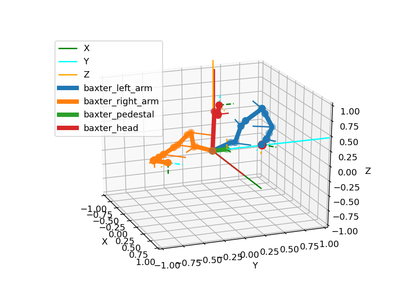
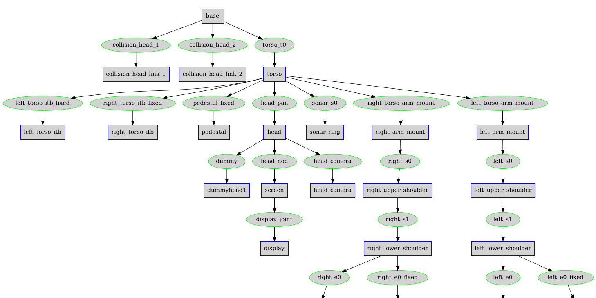

# IKPy

[](https://pypi.python.org/pypi/ikpy/)

[](https://zenodo.org/doi/10.5281/zenodo.6551105)






## Demo

Live demos of what IKPy can do \(click on the image below to see the video\):


[](https://www.youtube.com/watch?v=H0ysr5qSbis)
[](https://www.youtube.com/watch?v=Jq0-DkEwwj4)

Also, a presentation of IKPy: [Presentation](https://github.com/Phylliade/ikpy/blob/master/tutorials/IKPy%20speech.pdf).

## Features

With IKPy, you can:

* Compute the **Inverse Kinematics** of every existing robot.
* Compute the Inverse Kinematics in **position, [orientation](./tutorials/Orientation.ipynb)**, or both
* Define your kinematic chain using **arbitrary representations**: DH (Denavit–Hartenberg), URDF, custom...
* Automatically import a kinematic chain from a **URDF file** or a **MuJoCo MJCF file**.
* Support for arbitrary joint types: `revolute`, `prismatic` and more to come in the future 
* Use pre-configured robots, such as [**baxter**](./tutorials/Baxter%20kinematics.ipynb) or the **poppy-torso**
* IKPy is **precise** (up to 7 digits): the only limitation being your underlying model's precision, and **fast**: from 7 ms to 50 ms (depending on your precision) for a complete IK computation.
* **Plot** your kinematic chain: no need to use a real robot (or a simulator) to test your algorithms!
* Define your own Inverse Kinematics methods.
* Utils to parse and analyze URDF files:



Moreover, IKPy is a **pure-Python library**: the install is a matter of seconds, and no compiling is required.

## JAX Backend (Experimental)

IKPy now includes an optional **JAX backend** for accelerated inverse kinematics using automatic differentiation.

### Benefits

| Scenario | Speedup vs NumPy |
|----------|------------------|
| Single target (complex chains) | **1.5-4x faster** |
| Trajectory tracking (warm start) | **2-3x faster** |
| Cold start | **More robust** (fewer local minima) |

The JAX backend uses an analytical Jacobian computed via autodiff, which provides:
- Faster convergence on difficult targets
- Better robustness against local minima
- Significant speedup on robots with 5+ joints

### Installation

```bash
pip install 'ikpy[jax]'
```

### Usage

```python
from ikpy.chain import Chain

# Load your robot
chain = Chain.from_urdf_file("my_robot.urdf")

# Use JAX backend for IK
result = chain.inverse_kinematics(
    target_position=[0.5, 0.2, 0.3],
    backend="jax"  # Use JAX instead of NumPy
)

# Trajectory tracking with warm start (recommended)
current_joints = None
for target in trajectory:
    result = chain.inverse_kinematics(
        target_position=target,
        initial_position=current_joints,
        backend="jax"
    )
    current_joints = result  # Use solution as next initial guess
```

### Configuration

Two arguments bound the work of the optimizer, and they mean the same thing whichever backend and
whichever optimizer you use:

```python
chain.inverse_kinematics(
    target_position=target,
    optimizer_budget=10,  # Approximate number of evaluations allowed
    tol=1e-4,             # Convergence tolerance
)
```

`optimizer_budget` is a budget rather than a hard cap: an optimizer finishing a gradient estimation
can overshoot it slightly. Use it to trade accuracy for speed in real-time loops.

Everything else goes through `optimizer_kwargs`, forwarded as-is to the SciPy optimizer in use
(`scipy.optimize.least_squares` by default, `scipy.optimize.minimize` for `optimizer="scalar"`):

```python
chain.inverse_kinematics(target_position=target, optimizer_kwargs={"loss": "soft_l1"})
```

The bounds are derived from the limits of the links, so they cannot be set there, and neither can an
option that `optimizer_budget` or `tol` is already setting.

The JAX backend uses `scipy.optimize.least_squares` with an analytical Jacobian, and takes a few
options of its own on top:

```python
chain.inverse_kinematics(
    target_position=target,
    backend="jax",
    optimizer_budget=10,           # Same argument as above
    scipy_method='trf',            # 'trf', 'dogbox', or 'lm'
    scipy_x_scale='jac',           # Auto-scaling (default, recommended)
    use_analytical_jacobian=True,  # Set False for finite differences
)
```

### When to use JAX vs NumPy

| Use Case | Recommended Backend |
|----------|---------------------|
| Simple chains (≤4 joints), easy targets | NumPy |
| Complex chains (≥5 joints) | **JAX** |
| Trajectory tracking | **JAX** |
| Real-time control | **JAX** (after warmup) |
| One-off calculations | NumPy (no compilation overhead) |

> **Note**: The first JAX call includes JIT compilation overhead (~1-5s). Subsequent calls are fast.

## MuJoCo (MJCF) Support

In addition to URDF, IKPy can import kinematic chains directly from **MuJoCo MJCF** XML files:

```python
from ikpy.chain import Chain

chain = Chain.from_mjcf_file("ur5e.xml", base_elements=["base"])
```

The parser supports MuJoCo compiler settings, default classes (including `childclass` inheritance), and provides helpers to inspect models (`ikpy.mjcf.get_body_names`, `ikpy.mjcf.get_joint_names`).

## Installation

You have three options:

1. From PyPI \(recommended\) - simply run:

   ```bash
   pip install ikpy
   ```

   If you intend to plot your robot, you can install the plotting dependencies \(mainly `matplotlib`\):

   ```bash
   pip install 'ikpy[plot]'
   ```

   If you want to use the JAX backend, install the JAX dependencies:

   ```bash
   pip install 'ikpy[jax]'
   ```

2. From source - first download and extract the archive, then run:

   ```bash
   pip install ./
   ```

   NB: You must have the proper rights to execute this command

## Quickstart

Follow this IPython [notebook](https://github.com/Phylliade/ikpy/blob/master/tutorials/Quickstart.ipynb).

## Guides and Tutorials

Go to the [wiki](https://github.com/Phylliade/ikpy/wiki). It should introduce you to the basic concepts of IKPy.

## API Documentation

An extensive documentation of the API can be found [here](http://ikpy.readthedocs.org).

## Dependencies and compatibility

Starting with IKPy v4, Python 3.10 or above is required.
Starting with IKPy v3.1, only Python 3 is supported. 
For versions before v3.1, the library can work with both versions of Python \(2.7 and 3.x\).

In terms of dependencies, it requires `numpy` and `scipy`.


`sympy` is highly recommended, for fast hybrid computations, that's why it is installed by default.

`matplotlib` is optional: it is used to plot your models \(in 3D\).

## Contributing

IKPy is designed to be easily customisable: you can add your own IK methods or robot representations \(such as DH-Parameters\) using a dedicated [developer API](https://github.com/Phylliade/ikpy/wiki/Contributing).

Contributions are welcome: if you have an awesome patented \(but also open-source!\) IK method, don't hesitate to propose adding it to the library!

## Links

* If performance is your main concern, `aversive++` has an inverse kinematics [module](https://github.com/AversivePlusPlus/ik) written in C++, which works the same way IKPy does.

## Citation

If you use IKPy as part of a publication, please use the Bibtex below as a citation:

```bibtex
@software{Manceron_IKPy,
author = {Manceron, Pierre},
doi = {10.5281/zenodo.6551105},
license = {Apache-2.0},
title = {{IKPy}},
url = {https://github.com/Phylliade/ikpy}
}
```
