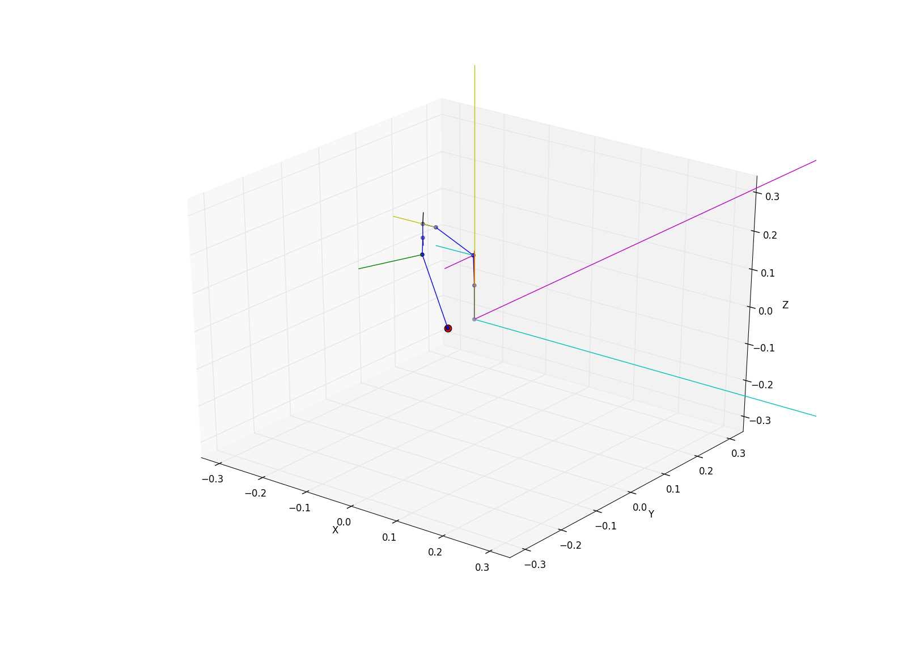

# Getting started #

This tutorial will introduce you to the basic concepts of IKPy.
You can test a live version in the corresponding [IPython Notebook](https://github.com/Phylliade/ikpy/blob/master/notebooks/Quickstart.ipynb)


# The Chain object

The [`Chain`](https://github.com/Phylliade/ikpy/blob/dev/src/ikpy/chain.py) is the main object you will work with : It is a list of links you can move, inspect, and plot.


## Creating a chain from a URDF file
One great feature of IKPy is that you can create your chains from a URDF file. If your file is URDF-compliant, it will work!
```
my_chain = Chain.from_urdf_file("poppy_ergo.URDF")
```

To discover more advanced features of URDF parsing, go to the dedicated [page](https://github.com/Phylliade/ikpy/blob/master/tutorials/ikpy/URDF.md).

# Getting the position of your chain (aka Forward Kinematics, aka FK)
Just call the `forward_kinematics` method of your chain using  the positions of each joint.
```
my_chain.forward_kinematics([  0.00000000e+00,  -7.83311388e-01,  -1.13929769e+00,
         8.39373996e-01,   6.05357632e-05,   7.31474063e-01,
         0.00000000e+00)
```

Would return :
```
[[1, 0, 0, 2],
[0, 1, 0, 2],
[0, 0, 1, 2],
[0, 0, 0, 1]]
```
which is a 4x4 transformation matrix.  
If you don't know about these matrixes, go to the section 'Using homogeneous coordinates' below.

# Setting the position of your chain (aka Inverse Kinematics, aka IK)
Just pass your frame matrix (a 4x4 [orientation + translation matrix](https://en.wikipedia.org/wiki/Transformation_matrix#Other_kinds_of_transformations)) to the `inverse_kinematics` method of your chain.

For example, with a target position of [2, 2, 2] and an orientation matrix being the identity :
```
my_chain.inverse_kinematics([[1, 0, 0, 2],
                                                [0, 1, 0, 2],
                                                [0, 0, 1, 2],
                                                [0, 0, 0, 1]])
```
Would return :
```
[  0.00000000e+00,  -7.85169183e-01, -9.71977343e-01, 8.39302626e-01,   7.03536053e-05,   7.31439909e-01,  0.00000000e+00]
```

To have more information about the Inverse Kinematics options, follow this [link](https://github.com/Phylliade/ikpy/wiki/Inverse-Kinematics).

## Using homogeneous coordinates
If you don't know these coordinates and the 4x4 matrix seems repelling, this section is for you!

This matrix is just a simple way to store a translation and a rotation.
To use such matrixes, there is an helper `geometry_utils.to_transformation_matrix(translation_vector, orientation_matrix)` function that will compute this matrix for you :
```
my_chain.inverse_kinematics(geometry_utils.to_transformation_matrix(
    [2, 2, 2],
    [[1, 0, 0],
    [0, 1, 0],
    [0, 0, 1]]))
```
Would return exactly the exact same thing as the previous section.


Note that the orientation_matrix parameter is optional.

# Plotting your chain
You can display your kinematic chain using the `plot` method of your chain object and passing the position of each joint of your chain.

Here we use the position given by the `inverse_kinematics` :
```
my_chain.plot(my_chain.inverse_kinematics([
    [1, 0, 0, 2],
    [0, 1, 0, 2],
    [0, 0, 1, 2],
    [0, 0, 0, 1]
    ]), show=True)
```

Here is the result :

You can recognize the arm of a [Poppy Torso](https://www.poppy-project.org/creatures/poppy-torso/?lang=fr).

The `show` argument is just a shortcut that will call `matplotlib.pyplot.show()` for you if set to `True`. It is set to `False` by default.

To use advanced plotting functions, such as displaying multiple chains on the same figure, follow [this guide](https://github.com/Phylliade/ikpy/blob/master/tutorials/ikpy/plotting.md).
